<!-- Perfil profesional de @rafajaque · rafajaque/rafajaque -->

  <picture>
    <source media="(prefers-color-scheme: dark)" srcset="assets/banner-dark.svg">
    <source media="(prefers-color-scheme: light)" srcset="assets/banner-light.svg">
    
  </picture>

  
  

## `01 / sobre mí`

Soy **Rafael Andrés Jaque Díaz**, Programador Analista de San Fernando, Chile. Desarrollo aplicaciones Android e integro bases de datos para construir soluciones útiles y mejorar sistemas.

Mi experiencia combina **desarrollo de software, análisis de datos y soporte TI**, con una trayectoria previa en seguridad electrónica y salud. Esa combinación aporta una mirada técnica y centrada en las personas.

- **Desarrollo:** Android, Firebase y Google Maps API.
- **Forma de trabajo:** análisis de requerimientos, prototipado, control de versiones y metodologías ágiles.
- **Formación:** Técnico Programador Analista, egresado con Excelencia Académica en 2024; Ingeniería en Informática en curso.
- **Idiomas:** español e inglés avanzado.

 

## `02 / tecnologías y herramientas`

<table>
  <tr>
    <td width="50%" valign="top">
      <h3>▸ Desarrollo móvil</h3>
      
<strong>Java · Kotlin · Android Studio</strong>

      
Aplicaciones Android, integración con Firebase y Google Maps API.

    </td>
    <td width="50%" valign="top">
      <h3>▸ Datos y programación</h3>
      
<strong>Python · SQL · Firebase</strong>

      
Análisis de datos, conexión con bases de datos y optimización de sistemas.

    </td>
  </tr>
  <tr>
    <td valign="top">
      <h3>▸ Desarrollo web</h3>
      
<strong>JavaScript · PHP · HTML · CSS</strong>

      
Soluciones personalizadas y desarrollo de proyectos.

    </td>
    <td valign="top">
      <h3>▸ Entorno de trabajo</h3>
      
<strong>GitHub · VS Code · UML · Linux · Windows</strong>

      
Control de versiones, modelado, soporte TI y análisis de requerimientos.

    </td>
  </tr>
</table>

## `03 / experiencia`

| Período | Rol y organización | Enfoque |
| :--- | :--- | :--- |
| **2025** | Analista de datos · **Ranco Cherries** | Análisis de datos. |
| **2024–2025** | Soporte TI · **Municipalidad de Placilla** | Soporte tecnológico. |
| **2024** | Práctica Profesional TI · **Municipalidad de Placilla** | Aplicaciones Android con Firebase; optimización y conexión de sistemas internos. |
| **Desde 2023** | **Desarrollo freelance y proyectos personales** | Aplicaciones Android con bases de datos y Google Maps API; soluciones para clientes. |
| **2020–2023** | Técnico CCTV · **Alianza e ISEG Chile** | Instalación, supervisión y mantenimiento de sistemas de seguridad electrónica. |

  
<strong>Mi trayectoria en salud y gestión</strong>

- **Promotor Académico · Universidad Finis Terrae (2017–2020):** gestión de procesos de admisión y liderazgo de equipo.
- **Internado Clínico · Clínica Las Condes (2019–2020):** atención integral y análisis clínico como parte de mi formación en enfermería.

## `04 / formación y aprendizaje`

**Ingeniería en Informática · mención Desarrollo de Sistemas**  
AIEP, San Fernando · En curso.

**Técnico Programador Analista**  
AIEP, San Fernando · 2024 · Excelencia Académica.

**Licenciatura en Enfermería · mención Biomedicina e Innovación Social**  
Universidad Finis Terrae, Santiago · 2021 · Minor en Bioética.

  
<strong>Certificaciones</strong>

- Seguridad de la Información ISO 27001 · AIEP / Telefónica · 2023.
- Herramientas para la Innovación · AIEP · 2023.
- Sustentabilidad en la Organización · AIEP · 2023.
- Liderazgo e Innovación · Universidad Finis Terrae · 2019.

---

<strong>¿Conversamos sobre tu próximo proyecto?</strong> 
<a href="mailto:rafajaqued@gmail.com">rafajaqued@gmail.com</a> · <a href="https://github.com/rafajaque">@rafajaque</a>  
Android · Datos · Sistemas San Fernando, Región de O’Higgins · Chile

